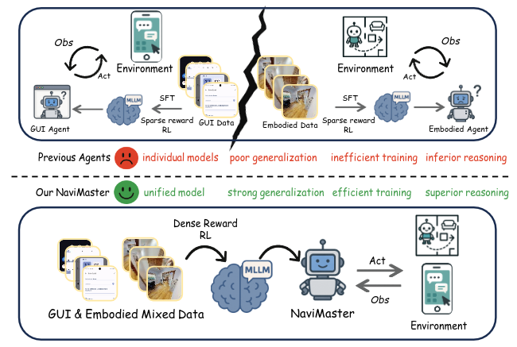
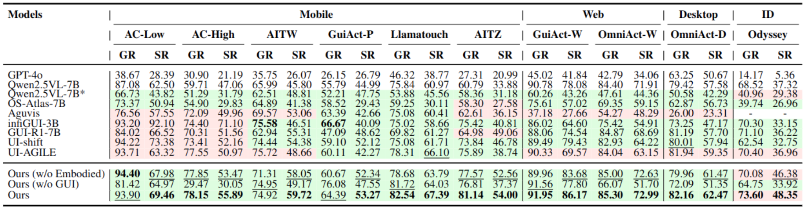
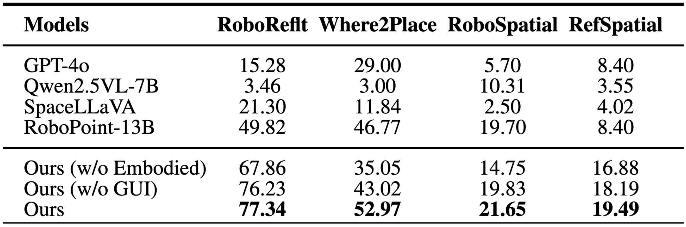
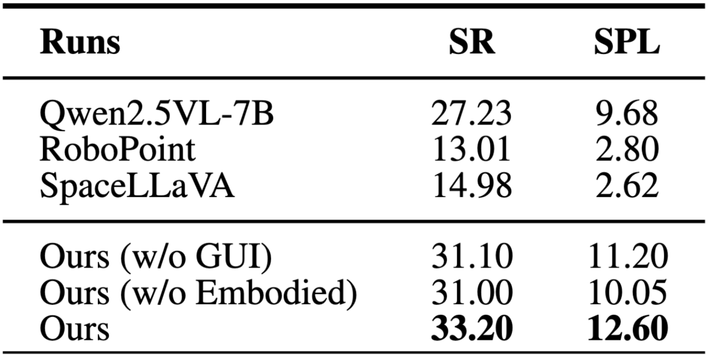

# NaviMaster: Learning a Unified Policy for GUI and Embodied Navigation Tasks

This is the official repo for "NaviMaster: Learning a Unified Policy for GUI and Embodied Navigation Tasks".
<div align="center">

[\[🏠Homepage\]](https://iron-boyy.github.io/navimaster-page/) | [\[💻Code\]](https://github.com/Iron-Boyy/NaviMaster) | [\[📝Paper\]](https://arxiv.org/abs/2508.02046)  | [\[🤗Models\]](https://huggingface.co/Thegun/NaviMaster-7B) | [\[🤗Data\]](https://huggingface.co/datasets/Thegun/NaviMaster-Dataset-2w)

</div>

## News

- [2026/03/18] We released the code and scripts.
- [2026/01/14] We released [Dataset](https://huggingface.co/datasets/Thegun/NaviMaster-Dataset-2w)!
- [2025/11/08] We released [Model](https://huggingface.co/Thegun/NaviMaster-7B)!
- [2025/08/04] Our NaviMaster paper ([NaviMaster: Learning a Unified Policy for GUI and Embodied Navigation Tasks](https://arxiv.org/abs/2508.02046)) can be accessed in arXiv!

## Overview

NaviMaster is the first unified agent that jointly handles Graphical User Interface (GUI) navigation and embodied navigation within a single framework. By reformulating both tasks into a visual-target trajectory format and training a unified policy via reinforcement learning (GRPO) with a distance-aware dense reward, NaviMaster achieves strong cross-domain generalization and outperforms state-of-the-art specialists on out-of-domain benchmarks.

<p align="center">
  
</p>


## 📦 Repository Structure
```
NaviMaster/
├── assets/                  # Figures and teaser images
├── data/                    # Training data
├── verl/                    # Core code
│   ├── models/              # Model wrappers (Qwen2.5VL, GRPO policy)
│   ├── single_controller/   # Controller logic for resource and execution flow
│   ├── trainer/             # GRPO trainer (adapted from EasyR1)
│   ├── utils/               # Utils
│   └── workers/             # Distributed worker processes
├── scripts/                 # Entry points
│   ├── train.sh             # Unified training with GRPO
│   ├── runtime_env.yaml      
│   ├── model_merger.py      # Merge Checkpoints
│   └── config.yaml          # Training/Val configs (YAML)
├── tests/                   # Evaluation
│   ├── test-embodied        # Evaluation on Embodied benchmarks
│   └── test-gui             # Evaluation on GUI benchmarks
├── requirements.txt         # Python dependencies
├── setup.py                 # Package installation
└── README.md                # This file
```

## 🚀 Quick Start

### Installation

```
git clone https://github.com/Iron-Boyy/NaviMaster.git
cd NaviMaster
pip install -r requirements.txt
```

### Data Preparation

Download [NaviMaster-Dataset-2w](https://huggingface.co/datasets/Thegun/NaviMaster-Dataset-2w) and place it under ```data/```.

### RL Training

Train NaviMaster on mixed GUI + embodied data:
```
cd scripts/
bash train.sh
```

## Evaluation

### GUI Tasks 
First prepare the evaluation dataset [Android Control](https://github.com/google-research/google-research/tree/master/android_control) and place it under ```test-gui/data/androidcontrol```. Then run the following code:
```
cd tests/test-gui
bash inference.sh
bash eval.sh
```

### Embodied Tasks 
First prepare the evaluation dataset [Where2Place](https://huggingface.co/datasets/wentao-yuan/where2place), [RoboSpatial](https://huggingface.co/datasets/chanhee-luke/RoboSpatial-Home), [RoboReflt](https://github.com/luyh20/VL-Grasp), [RefSpatial](https://huggingface.co/datasets/JingkunAn/RefSpatial) and place it under ```test-embodied/data/```. Then run the following code:
```
cd tests/test-embodied
bash run_test.sh
bash eval.sh
```

## 📊 Key Results


## Result

### GUI Performance
The red background represents that the data source is in the training set of the corresponding model, while the green background represents that the test dataset is OOD for the model. Bold highlights the best results in the OOD setting, and underlined are the second-best.
<p align="center">
  
</p>

### Affordance Performance
These results demonstrate that NaviMaster’s fine- grained visual–spatial alignment significantly en- hances performance in both object-level and free- space referring.
Interpolate start reference image.
<p align="center">
  
</p>

### Embodied Navigation Performance
NaviMaster achieves the highest Success Rate and SPL, representing a substantial improvement over the base model.
<p align="center">
  
</p>


## 📖 Citation
If this repository or our dataset contributes to your research, please acknowledge it by citing our paper as follows.
```
@article{luo2025navimaster,
  title={Navimaster: Learning a unified policy for gui and embodied navigation tasks},
  author={Luo, Zhihao and Yan, Wentao and Gong, Jingyu and Wang, Min and Zhang, Zhizhong and Wang, Xuhong and Xie, Yuan and Tan, Xin},
  journal={arXiv preprint arXiv:2508.02046},
  year={2025}
}
```

